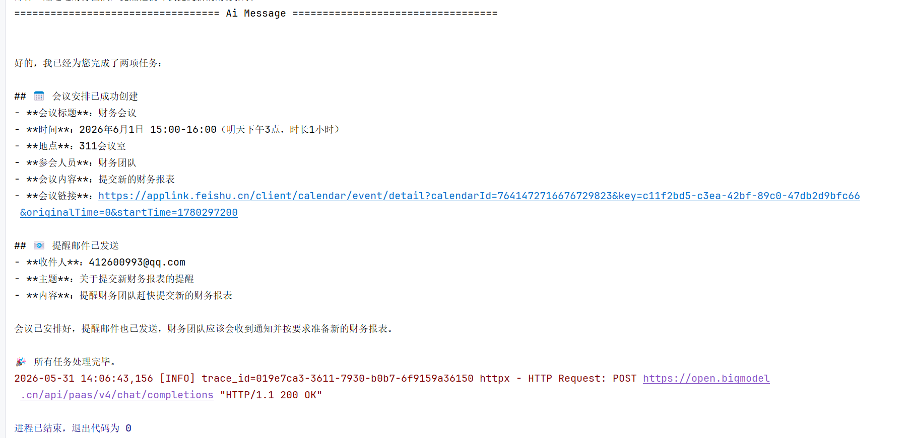

# 🧠 Multi-Agent Tool Calling System (LangGraph + LangChain)

🌐 Language / 语言:

- 🇨🇳 中文: [README](./README.md)
- 🇺🇸 English: [README_EN.md](./README.EN.md)

---

## 📌 Overview

A Multi-Agent orchestration system built with **LangGraph** and **LangChain**, integrated with **Redis distributed locks** for tool call idempotency, a code-level gateway for conflict prevention, full-traced logging, and Human-In-The-Loop (HITL) approval flows.

Use cases:

* Auto-scheduling Feishu (Lark) calendar events
* Auto-sending emails via QQ Mail SMTP
* Multi-agent coordinated task execution

---

## 🚀 Features

### 🧩 Multi-Agent Architecture

* **Supervisor Agent**: Breaks down user requests, dispatches subtasks to child agents, aggregates results.
* **Calendar Agent**: Handles date/time queries, busy-slot checks, and creates Feishu calendar events.
* **Email Agent**: Composes emails, extracts recipients, sends via SMTP.

### 🛠 Tools & Defenses

* `create_calendar_event` — Calls Feishu API to create events (includes a Python interval-overlap check before calling).
* `send_email` — SMTP-based email sender with CC and attachment support. SMTP synchronous operations are offloaded to a thread pool via `asyncio.to_thread`, so the event loop is never blocked.
* `get_current_datetime` — Returns the current server time to prevent LLM date hallucinations.
* `get_not_available_time_slots` — Internal function that returns occupied time slots for the code gateway to compare against.
* Feishu token fetching uses a **double-checked locking pattern**: first check Redis cache; if missing, acquire a distributed lock and check again before actually refreshing from the API. Under high concurrency, only one request refreshes the token — the rest read the cached result after the lock is released.

### 🔁 Distributed Idempotency Lock

The `@idempotent` decorator prevents duplicate tool executions caused by network retries, double clicks, or LLM loops.

* **Business-dimension hashing**: MD5 is computed from key fields like `User + Time + Title`. Changes in LLM wording don't affect the hash.
* **Three-state management**: `running` (executing), `done` (cached, return directly), `failed` (released for retry).
* **Cascade cleanup**: Deleting a session also removes its corresponding Redis lock.

### 📊 Log Tracing

* A **trace_id** (via ContextVars) spans every request end-to-end for easy debugging.
* Tool call logs record full input parameters and return values.
* The `handle_tool_errors` middleware logs error stacks and retry info.

### 🧠 Context Management

* A summarization middleware dynamically trims conversation history to fit token limits.
* Agents share state through **LangGraph State**.

### 👤 Human-In-The-Loop (HITL)

* Sensitive operations (sending emails, creating events) can trigger an approval interrupt — supports approve, reject, or edit-and-approve.

### 🔌 Frontend Connection Management

* WebSocket sends a heartbeat (`type: ping`) every 30 seconds to prevent NAT timeout.
* Auto-reconnects on disconnect (5-second interval), transparent to the user.

### 🔄 Error Handling

* **BusinessError**: Passed back to the LLM for self-correction (e.g., prompting the user to pick a different time slot).
* **FatalError**: Halts the flow and triggers manual intervention.

---

## 🏗 System Architecture

```text
            User Request
                  │
                  ▼
        Supervisor Agent
                  │
        ┌─────────┴─────────┐
        ▼                   ▼
  Calendar Agent        Email Agent
        │                   │
  (Code Gateway)          (SMTP)
   ├── get_current_datetime  └── 🔑 Redis Idempotent Lock
   ├── 🛡️ Conflict Check
   └── 🔑 Redis Idempotent Create

```

---

## 🔁 Idempotency & Gateway Design

### 1. Core Hash Formula

Every tool call computes an MD5 based on business-critical dimensions:

```python
# Calendar lock: locks on time range; LLM changing the description won't bypass it
md5(user_id + title + start_time + end_time)

# Email lock: locks on recipients and subject (to_list is sorted(), so LLM ordering doesn't affect the hash)
md5(user_id + sorted(to_list) + sorted(cc_list) + subject + body)
```

### 2. Two-Layer Defense

1. **Layer 1 (Code Gateway)**: Inside the tool, fetch busy slots, deserialize via `json.loads()`, then apply the intersection formula `max(req_start, slot_start) < min(req_end, slot_end)`. If overlapping, throw `BusinessError` immediately.
2. **Layer 2 (Redis Lock)**: After passing the gateway, attempt to acquire a Redis lock (`r.set(key, ..., nx=True)`). If successful, execute the core logic; if the key already exists with status `done`, return the cached result directly.

---

## 📦 Usage Example

```python
user_request = """
Schedule a meeting at 3pm tomorrow with the finance team for 1 hour,
topic: finance review, description: submit new financial report, room 311.
Also send a reminder email to xxxx@qq.com asking them to submit the report.
"""
```

---

## 🧪 Quick Start

### Requirements

- Python 3.10+
- Redis
- MySQL 8.0+
- PostgreSQL (for LangGraph Store)

### 1. Configuration

```bash
# Copy .env.example to .env and fill in your values
EMAIL_SENDER=your_email@qq.com
EMAIL_PASSWORD=your_smtp_password

CALENDER_BOT_APP_SECRET=xxx
SHARE_CALENDER=xxx

OPENAI_API_KEY=xxx
OPENAI_BASE_URL=xxx
```

### 2. Start Backend

```bash
python main.py
```

Server runs at `http://127.0.0.1:6002`.

### 3. Start Frontend

```bash
cd frontend
npm install
npm run dev
```

Open `http://localhost:5173` in your browser.

---

## 📁 Project Structure

```
├── main.py                  # Backend entry (FastAPI + WebSocket)
├── config.py                # Global config, logging, env vars
├── middleware.py             # Idempotent decorator + error handling middleware
├── storage.py               # Redis + PostgreSQL connection management
├── errors.py                # Custom exceptions (BusinessError / FatalError)
├── agents/
│   ├── supervisor_agent.py  # Supervisor Agent
│   ├── calender_agent.py    # Calendar Agent
│   └── email_agent.py       # Email Agent
├── tools/
│   ├── calender_tool.py     # Feishu calendar tool + code gateway
│   └── email_tool.py        # QQ Mail sender (with attachment support)
├── api/
│   ├── chat.py              # WebSocket chat endpoint
│   └── session.py           # Session CRUD API
├── db/
│   ├── mysql.py             # MySQL connection pool
│   ├── models.py            # Table schemas
│   └── crud.py              # Database operations
├── utils/
│   └── feishu.py            # Feishu token (double-checked lock) + event API
└── frontend/                # Vue 3 frontend (heartbeat + auto-reconnect)
```

> The files `sub.py`, `1.py`, `subagent_tutorial1.py`, and `test.py` in the root directory are proof-of-concept prototypes from earlier development stages. They are kept for reference and annotated with their purposes.

---

## 📊 Log Sample

```log
trace_id=... [create_calendar_event] Attempting lock redis_key=idempotent:3963f769ea...
trace_id=... [create_calendar_event] 🎯 Idempotent hit, returning cached result
trace_id=... agents.supervisor_agent - Last AI message from calendar agent...
trace_id=... 🛡️ Code gateway: fetched busy slots: ["09:00-10:00", "14:00-15:00"]
```

---

## 🧠 Tech Stack

* **LangChain & LangGraph (v0.2+)** — Agent orchestration
* **GLM-4.5-Flash (Zhipu AI)** — LLM model (OpenAI-compatible adapter)
* **Redis** — Distributed locks + result caching
* **Feishu Calendar API** — Event creation via Tenant Access Token
* **Python SMTP / asyncio / httpx** — Async email & HTTP
* **PostgreSQL** — Long-term memory (LangGraph Store)
* **tenacity** — Network retries with exponential backoff
* **MySQL** — Session & message persistence
* **Vue 3 + Vite** — Frontend UI

---

## 🔥 Project Highlights

Here are some real problems encountered during development and how they were solved:

### 1. Code Gateway: Replace LLM Judgment with Math

**Problem**: LLMs often misjudge time conflicts — even when a slot is occupied, they call the create API anyway.

**Solution**: Instead of relying on the LLM's prompt-based reasoning, hardcode an interval-overlap formula inside the `create_calendar_event` tool:

```python
def is_overlapping(req_start, req_end, slot_str):
    slot_start, slot_end = parse(slot_str)
    return max(req_start, slot_start) < min(req_end, slot_end)
```

If the requested time overlaps with any occupied slot, a `BusinessError` is thrown immediately. The LLM cannot bypass it.

### 2. Child Agent Result Validation

**Problem**: A child agent sometimes outputs a long message saying "Event created successfully" without actually calling the tool. The Supervisor has no way to tell the difference.

**Solution**: Before returning from `schedule_event`, scan all child agent messages and check whether the last AI message contains a `create_calendar_event` tool_call. If not, return an empty result so the Supervisor can detect the anomaly.

### 3. Redis Distributed Idempotent Lock

**Problem**: Network jitter, double clicks, or LLM loops cause the same request to be executed multiple times — emails sent twice, events created twice.

**Solution**: Wrap tool functions with the `@idempotent` decorator. It computes an MD5 hash from key fields (`User + Time + Title`) and uses it as the Redis lock key. Duplicate requests spin-wait (up to 5 rounds) and return the cached result from the first execution. The LLM changing wording doesn't break idempotency, because the hash only uses critical fields (recipient lists are `sorted()` before hashing).

**Additional details**:
- **Differentiated TTL**: Business errors (wrong params) cool down for 3 seconds so the LLM can retry quickly; system crashes (network outage) cool down for 10 seconds as circuit-breaking protection.
- The `handle_tool_errors` middleware **passes through** `GraphInterrupt` signals (HITL approval interrupts) instead of catching them, allowing the upstream graph engine to handle the approval flow properly.

### 4. Type Safety: Prevent LLM Truncation from Breaking Data

**Problem**: After multiple turns of conversation, the LLM may truncate JSON strings returned by child agents, causing `json.loads()` to fail.

**Solution**: Always deserialize with explicit `json.loads()` at critical boundaries, and call internal functions directly (bypassing LLM text generation) to obtain data at the source, ensuring format correctness.

---

## 🧠 System Capabilities Summary

* **Two-layer defense**: Code gateway (math) + Redis idempotent lock.
* **End-to-end trace_id**: One trace_id per request for easy log search and debugging.
* **HITL approval**: Sensitive operations trigger interrupts; supports approve, edit, or reject.
* **Fully async**: asyncio + httpx + aiomysql — tool calls never block the event loop.

---

### 📊 Running Demo


---

## 🚀 Roadmap

* [x] Redis distributed idempotent lock
* [x] Async tool chain
* [ ] User preference long-term memory (LangGraph Store)
* [ ] Frontend streaming typing effect
* [ ] Frontend approval card for HITL
* [ ] OpenTelemetry full-trace monitoring
* [ ] Message queue for load leveling
---
